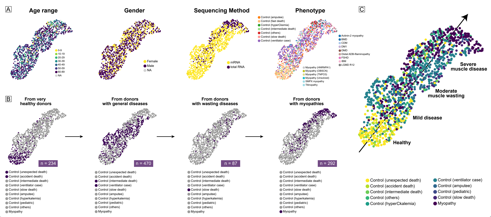

# Myopathy spectrum (stage 1)
> An integration analysis of bulk RNA-seq data from human skeletal muscles (1221 muscles x 9231 genes). 

## Dataset description
- **Date size**: 1221 muscles x 9231 genes
- **Data source**: GTEx database (n = 803), GEO datbase (n = 291), Helsinki (n = 127)
- **Phenotype**: 292 myopathies, 929 controls
- **Sequencing method**: 930 sequenced in mRNA (polyA) and 291 sequenced in total RNA (ribo)  

## Inclusion and exclusion criteria
1. Only human skeletal muscle tissue (no cell lines or organoids) 
2. Bulk-RNA sequencing by high throughput technics (no chip arrays or single-cell data)
3. Raw count data preserved (datasets shared in transformed count format were excluded)

## Folder descriptions
- **DEG**: Differential expression analysis (DEG) results exported from edgeR.
- **Meta**: Meta data (Data_source/Geo_accession/Author_Date/PMID/Sample_id/Gsm_accession/Casual_gene/Phenotype/Biopsy site/sequencing method/sequencing platform/Se/Age range) for the integration dataset.
- **TAPE**: Tissue deconvoluation results annotated with two human skeletal msuclse single-cell datasets ([Tabula Sapiens](https://tabula-sapiens-portal.ds.czbiohub.org/) and [GSE143704](https://www.ncbi.nlm.nih.gov/geo/query/acc.cgi?acc=GSE143704)).
- **Helsinki data**: 127 skeletal muscle bulk RNA-seq data from Helsinki ([Group Udd](https://www.folkhalsan.fi/en/knowledge/research/genetics/group-udd/), Folkhälsan Research Center, University of Helsinki). Among these samples, 39 have also been reported as [GSE15175717](https://www.ncbi.nlm.nih.gov/geo/query/acc.cgi?acc=GSE151757). 
- **GEO data**: 291 skeletal muscle bulk RNA-seq data downloaded from the GEO database ([GSE115650](https://www.ncbi.nlm.nih.gov/geo/query/acc.cgi?acc=GSE115650), [GSE140261](https://www.ncbi.nlm.nih.gov/geo/query/acc.cgi?acc=GSE140261), [GSE175861](https://www.ncbi.nlm.nih.gov/geo/query/acc.cgi?acc=GSE175861), [GSE184951](https://www.ncbi.nlm.nih.gov/geo/query/acc.cgi?acc=GSE184951), [GSE201255](https://www.ncbi.nlm.nih.gov/geo/query/acc.cgi?acc=GSE201255), [GSE202745](https://www.ncbi.nlm.nih.gov/geo/query/acc.cgi?acc=GSE202745)).
- **GTEx data**: 803 skeletal muscle bulk RNA-seq data downloaded from the GTEx Analysis V8 ([dbGaP Accession phs000424.v8.p2](https://gtexportal.org/home/datasets#datasetDiv1)). The main biopsy site is the gastrocnemius muscle, 2 cm below the patella.
- **Integration data**: Processed data during the Integration process.
- **Validation**: validation data downloaded from the supplementary files from the used GEO datasets or generated from the integration dataset.

## Mainly used packages and tools
- **Python (3.8.1)**: [Scanpy](https://scanpy-tutorials.readthedocs.io/en/latest/pbmc3k.html) (high-dimensional data processing), [gseapy](https://gseapy.readthedocs.io/en/latest/gseapy_example.html) (pathway analysis), [TAPE](https://github.com/poseidonchan/TAPE) (celltype deconvolution), [conorm](https://gitlab.com/georgy.m/conorm) (count normalization).
- **R (4.2.2)**: [EdgeR](https://bioconductor.org/packages/edgeR/) (DEG analysis), [ComBat-seq](https://github.com/zhangyuqing/ComBat-seq) (batch adjustment), [DescTools](https://search.r-project.org/CRAN/refmans/DescTools/html/JonckheereTerpstraTest.html) (Jonckheere trend test).

## Detailed phenotypes
|           Phenotype            | Sample size |  Data source   | Sequencing method |
| :----------------------------: | :---------: | :------------: | :---------------: |
|    Control (accident death)    |     31      |      GTEx      |       mRNA        |
|   Control (unexpected death)   |     203     |      GTEx      |       mRNA        |
| Control   (intermediate death) |     46      |      GTEx      |       mRNA        |
|  Control   (ventilator case)   |     424     |      GTEx      |       mRNA        |
|     Control (slow   death)     |     87      |      GTEx      |       mRNA        |
|       Control   (others)       |     111     |    GTEx/GEO    |  mRNA/total RNA   |
|      Control   (amputee)       |     24      |    Helsinki    |       mRNA        |
|    Control   (hyperCkemia)     |      3      |    Helsinki    |       mRNA        |
|              FSHD              |     61      |      GEO       |     total RNA     |
|              DM1               |     44      |      GEO       |     total RNA     |
|            LGMD R12            |     41      |      GEO       |     total RNA     |
|              CDM               |     36      |      GEO       |     total RNA     |
|          Titinopathy           |     31      |    Helsinki    |       mRNA        |
|              IBM               |     28      | Helsinki (GEO) |       mRNA        |
|              DMD               |      5      |      GEO       |     total RNA     |
|              BMD               |      5      |      GEO       |     total RNA     |
|      Actinin-2   myopathy      |      5      |    Helsinki    |       mRNA        |
|      Myopathy   (HNRNPA1)      |      5      |    Helsinki    |       mRNA        |
|         SMPX myopathy          |      4      |    Helsinki    |       mRNA        |
|       Myopathy   (OBSCN)       |      1      |    Helsinki    |       mRNA        |
|       Myopathy   (TNPO3)       |      1      |    Helsinki    |       mRNA        |
|   Distal   ADB-filaminopathy   |      1      |    Helsinki    |       mRNA        |
|     Myopathy   (Unsolved)      |     24      |    Helsinki    |       mRNA        |

[GTEx phenotype catgeories](https://biospecimens.cancer.gov/resources/sops/docs/GTEx_SOPs/BBRB-PM-0003-F6%20GTEx%20Clinical%20Collection%20Case%20Report%20Form%20(CRF).pdf):
- **Control (accident death)**: Violent and fast death Deaths due to accident, blunt force trauma or suicide, terminal phase estimated at < 10 min [Healthy]. 
- **Control (unexpected death)**: Fast death of natural causes Sudden unexpected deaths of people who had been reasonably healthy, after a terminal phase estimated at < 1 hr (with sudden death from a myocardial infarction as a model cause of death for this category) [Healthy].
- **Control (intermediate death)**: Intermediate death Death after a terminal phase of 1 to 24 hrs (not classifiable as 2 or 4); patients who were ill but death was unexpected [Diseased].
- **Control (ventilator case)**: Ventilator Case All cases on a ventilator immediately before death [Diseased].
- **Control (slow death)** : Slow death Death after a long illness, with a terminal phase longer than 1 day (commonly cancer or chronic pulmonary disease); deaths that are not unexpected [Wasting].

## **Acknowledgement:**

We thank the participants and their families who donated their muscle tissues for research purposes. We would also like to extend special thanks to the authors of these publicly available muscle datasets, which will facilitate further research in the future.

## Citation
Zhong, H., Sian, V., Johari, M. et al. Revealing myopathy spectrum: integrating transcriptional and clinical features of human skeletal muscles with varying health conditions. Commun Biol 7, 438 (2024). [https://doi.org/10.1038/s42003-024-06143-3
        
        
        
        ](https://doi.org/10.1038/s42003-024-06143-3
        
        
        
        )
        
        
        
        
